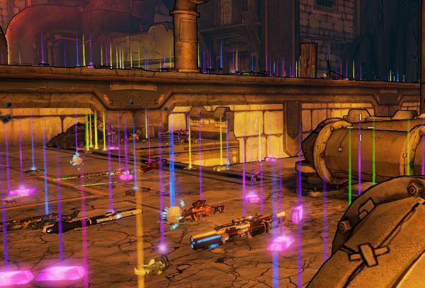

BL2 Better Loot Mod by Apocalyptech
===================================

This mod aims to make loot in Borderlands 2 "better" in general.  It's
essentially a cheat mod, intended for those BL2 players like myself who
tend to play in Normal most of the time, dislike grinding, get bored easily
by the uninteresting and drab loot that typically gets dropped in-game, and
who often end up just resorting to Gibbed to be able to play around with
some better gear.  The goal, personally, was to get the loot drops in-game
to a point where I never felt tempted to open up Gibbed.

The mod must be loaded into BLCMM, and nearly all of the mod can be toggled
on or off inside BLCMM as you'd hope, on an item-by-item basis.  Basically
every bullet point in the "Overview" section is its own "folder" once imported.
See the [Configuration](#configuration) section for the most obvious
configuration areas.

**NOTE:** A few mods are known to do some weird things in conjunction with
this mod.  See the "Compatibility" section below.  **BL2 Reborn** in
particular is known to cause crashes and other bad behavior, so definitely
do not use this with BL2 Reborn.

* [Usage/Installation](#usageinstallation)
* [Mod Overview](#mod-overview)
  * [Configuration](#configuration)
* [Compatibility](#compatibility)
  * [UCP](#ucp)
  * [BL2 Reborn](#bl2-reborn)
  * [BL2 Cold Dead Hands](#bl2-cold-dead-hands)
  * [Shadowevil's "VaultHunter" mod](#shadowevils-vaulthunter-mod)
  * [Hemaxhu's "More Chubbies" mod](#hemaxhus-more-chubbies-mod)
  * [SirUmnei's "COM Overhaul Pack"](#sirumneis-com-overhaul-pack-and-possibly-other-mods-which-touch-coms)
  * [Other Mods](#other-mods)
* [Loot Purposefully Excluded from Pools](#loot-purposefully-excluded-from-pools)
* [Other Recommended Mods](#other-recommended-mods)
* [Bugs](#bugs)
* [TODO](#todo)
* [Other Notes](#other-notes)
* [Mod Construction / Implementation Details](#mod-construction--implementation-details)
* [Credits](#credits)
* [Licenses](#licenses)
* [Changelog](#changelog)

Usage/Installation
==================

This mod must be imported into BLCMM using `File -> Import single mod`.
Simply choose the file `BL2 Better Loot.blcm` and have at it!

Previous versions of this mod had various options, including offline and
standalone variants, but these are no longer provided.  BLCMM itself provides
all that functionality very easily now.  Even if you intend to use nothing
but this single mod, be sure to import into BLCMM and use the file that it
saves.

The previous "Lootsplosion" and "Reasonable" variants have been merged into
the single mod file, and you can now choose various aspects of the mod in
several "mutually exclusive" categories, meaning that you can only choose
one of the options in each.  This way you can tailor the mod to what you want
to do a little bit more easily.  See the [Configuration](#configuration) section
for more detail.

Mod Overview
============

*(Note that various behaviors in here can be changed by selecting from various
options in the mod file itself.)*

Specifically, this mod does the following:

* By default, adds all legendaries/uniques/pearls/seraph/effervescent items
  (weapons, grenade mods, class mods, shields, relics) into the global
  "legendary" loot pools, so you'll start seeing those much more frequently.
  * The Fire Drill, an unused Infinity variant from the Commander Lilith DLC,
    has been added to the global drop pools.  No other unused weapon from
    that DLC has been added, though -- there are a few others.
* By default, loot will skew much more rare.  You should expect to see
  those legendaries/uniques/pearls/seraphs/effervescents far more frequently
  than in vanilla BL2.
* Adds the "Alignment" Class Mods from the Dragon Keep DLC into the global
  Class Mod drop pools (and makes those COMs always drop at at least blue
  rarity).
* By default, adds Gemstone-rarity weapons into the E-Tech weapon pools.
* Darts and Spikers drop less frequently in the E-Tech pools.
* Normalizes weapon type drops a bit.  *(Decreases pistol drop chance,
  increases all other weapon types.)*
* Lootable Container Changes:
  * In the default configuration, "regular" treasure chests will always
    provide at least blue-rarity gear, and has a decent chance of including
    stuff from the legendary pools.  This can be configured, though.
  * Also in the default configuration, "epic" treasure chests have an
    extremely high probability of dropping from the legendary pools.
  * Mordecai's Stash (from the mission The Good, The Bad, and the Mordecai) has
    been changed to only drop sniper rifles, and vastly improves the gear
    quality.
  * Roland's Chest in Sanctuary has been changed to only have loot pools with
    weapons, and is guaranteed to have at least a couple legendaries.
  * Dice Chests (from the Tiny Tina DLC) will have a small chance of containing
    legendary loot on a "very high" roll.
  * Captain Scarlett DLC and Big Game Hunt DLC endgame chests were converted
    to Epic chests.
  * Non-Mimic chests from Dragon Keep DLC will partially pull from the Epic
    chest pool as well.
  * When lockers spawn gear, they will always be blue-rarity.  *(Previously
    lockers had a chance to spawn even legendaries, so some could potentially
    see this as a drawback)*
  * Safes have been improved: Eridium configurations are far more likely, cash
    quantities have been improved.  Gear drop chances have been dropped
    somewhat, but gear from safes will always be legendary.
  * Fixes some "shield" loot configurations which had an error and would never
    spawn, previously.
  * Marcus's Storeroom, from the Commander Lilith DLC, has been vastly improved.
* Makes Eridium drop 2.5x more often
* Makes Torgue Tokens more numerous when dropped
* Boss drop pools are generally improved, and by default, bosses are guaranteed
  to drop as many items from their unique drop pool as are in that pool.
  *(Though that can be configured easily.)*
  * Bosses with just a single unique drop will therefore be guaranteed to drop
    that item.
  * If a boss has more than one in their drop pool, you may get duplicates
    of one rather than one of each.
* Raid Bosses will drop better loot, and will drop as many unique items as are
  in their pool.  *(Though that can be configured easily)*
* Seraph Crystals will drop from Seraph Guardians even in Normal mode, and the
  amount of Seraph Crystals have been increased.
* Fixes/Changes to some enemies' drop pools:
  * Badasses are guaranteed to drop some loot
  * Chubby drop pool has been improved
  * Some "Badass" enemies weren't actually pulling from the badass drop pool,
    which has been fixed:
    * Badass Bedrock Bullymongs
    * Badass Boroks
    * Badass Fire Archers
    * Badass Knights
    * Badass Yeti
    * Infected Badass Sprouts
    * Undead Badass Psychos
    * Wattle Gobble Tributes *(three out of the twelve weren't set to drop anything)*
  * A few more standard enemies have also been set to drop from the badass pool:
    * Arguk the Butcher
    * Bonehead 2.0
    * Bridget Hodunk and Colin Zaford
    * Bulstross
    * Deputy Winger
    * Giant Craboid
    * Gluttonous Thresher *(actually drops from the "super" badass pool)*
    * Individual Handsome Sorcerer stage bosses
    * Jack's Body Double
    * Knuckledragger
    * Mick Zaford
    * Mortar
    * Papa/Jimbo Hodunk
    * Rakkman
    * Roscoe
    * Shirtlesss Men
    * Sinkhole
    * Skeleton Giants
  * Then a few other tweaks to certain enemies:
    * Laney's Dwarf companions will drop crystals, and have a good chance of dropping
      a gemstone weapon between 'em.
    * The Warrior's non-unique drops have been improved slightly
    * Witch Doctors (both in Big Game Hunt and Son of Crawmerax) will drop an Eridium
      stick, and have a pretty good chance of dropping a Relic as well.
    * Elite Savages are guaranteed to drop loot (though just from the standard pool)
    * The Loot Leprechaun (from Wedding Day Massacre) will drop from the Epic Chest
      pool, rather than the regular treasure chest pool.
    * The BLNG Loader (from Wedding Day Massacre) will drop from the badass pool and
      also drop a whole bunch of money.  I've always been mystified why it didn't
      drop a ton of money from the start.
    * Sandworms from the Commander Lilith DLC will be a bit more likely to drop
      the Toothpick and Retainer
    * New Pandora troops will be a bit more likely to drop the Infection Cleaner
* Improved gifts received in The Talon of God (from Sanctuary residents) to
  be purples and gemstones.
* Remove early-game loot restrictions.  This is actually a superset of the
  similar feature already present in UCP, and is copied from my own BL2 Early Bloomer
  mod.  This version enables spawning of basically everything from the beginning,
  including all grenade types, relics, class mods, rocket launchers, etc.  Both
  this and the UCP "Remove Loot restriction in the beginning areas" section, and
  even Early Bloomer itself, can be active at the same time with no ill effects --
  it'll just mean that the relevant commands get executed twice.

### Configuration

There are a few categories in the mod which are explicitly intended to be
user-changeable:

* **Remove Level-Based Loot Restrictions** - This is active by default, and allows
  basically all item/weapon types, elements, grenades, COMs, etc, from the very
  beginning of the game.  It can be toggled off if you'd prefer that to not be the
  case, though some of the unlocks are hardcoded in the main area of the mod, since
  we need *some* unlocks for things to work properly in the early levels.  This is
  a copy of my own BL2 Early Bloomer mod, though there's no harm in having both
  active at the same time.
* **Legendary and E-Tech Pool Adjustments** - The default configuration adds all
  unique, legendary, seraph, pearlescent, and effevescent weapons/items (including
  gemstone weapons) into the main global loot pools, so all items can
  technically be found just about anywhere.  You can tweak which groups of
  items/weapons get added by going in here and disabling any you don't want to
  drop.
* **Drop Quality** - This is the main section which determines the quality of
  drops that you'll get throughout the game.  The choices range from "Excellent"
  (which used to be called "Lootsplosion," pre-1.3.0), all the way down to
  "Stock-ish", which is pretty close to the stock/vanilla BL2 drop rates, though
  it's actually a *bit* better.  If you expand any of those categories, you'll
  see the exact percentages that it provides.  The default setting is Excellent.
* **Boss Unique Drop Rate** - This section lets you choose how often bosses drop
  their unique items/weapons.  The default setting is to make bosses always drop
  their unique gear, but it can be configured all the way down to the stock/vanilla
  drop rates.
* **Boss Unique Drop Quantities** - This section lets you define how *many* unique
  drops a boss will drop.  In the default configuration, if a boss has two unique
  drops, it'll drop two items from that pool.  It may end up being two of the same
  item, but it could also be one of each.  For enemies with huge loot pools, this
  can end up producing quite a few legendary drops.  For instance, the Warrior will
  drop *eight* by default.  This section lets you specify the quantities you want,
  though, and can be configured to go back to just a single drop, as BL2 does by
  default.

Compatibility
=============

### UCP

This mod should be fully compatible with UCP 4.2.  It should also probably run
fine without, though it's received less testing that way.

### BL2 Reborn

This mod is **not** compatible with BL2 Reborn.  There are known crashes and
other sorts of instability when trying to use the two together.  Avoid using
the two at the same time!

### BL2 Cold Dead Hands

These two mods actually work real well together.  Cold Dead Hands does override
a lot of what Better Loot does, so huge areas of this mod don't actually do
anything when CDH is active, but CDH only touches weapons+shields.  So if you
use both together, you'll be able to get the Better Loot benefits for COMs,
Grenades, Relics, etc.  I tend to use both of them together, myself.  Just make
sure to have Cold Dead Hands *after* Better Loot in your mod list, so that
it overrides things properly.

### Shadowevil's "VaultHunter" mod

This mod and Shadowevil's "VaultHunter" mod, which creates a Legendary-level
Vault Hunter's Relic, don't play very well together, especially with Raid boss
drops.  The combination has been known to sometimes crash Borderlands after
defeating the Ancient Dragons, in fact, and legendary drops will be *far* more
frequent than is useful.

I'm pretty sure that this mod makes the vanilla game's "Vault Hunter's
Relic" completely useless, but if you're using this mod, you certainly
won't miss it.

### Hemaxhu's "More Chubbies" mod

Hemaxhu's "More Chubbies" mod isn't *incompatible* with this one, but you
will almost certainly find it to be quite excessive if Chubbies are spawning
more frequently.  The best thing to do if using More Chubbies is probably to
disable this mod's Chubby buffs, at least partially.  There are two toggles
you can use in this mod:

* `Base Mod Configuration -> Better Enemy Drops -> Better Badass Pool Definitions -> Chubby Enemies`
* `Boss Unique Drop Quantities -> X -> Chubby/Tubby Enemies`

### SirUmnei's "COM Overhaul Pack" (and possibly other mods which touch COMs)

The COM Overhaul Pack, in conjunction with this mod, will end up creating
items which will get deleted by Borderlands after you save/quit.  You should
be able to avoid this by turning off this mod's `Base Mod Configuration ->
Loot Pool Tweaks -> Force Alignment COMs Blue And Higher`.

### Other Mods

Obviously this mod will conflict with other mods which play with the same
variables.  I know that Hemaxhu's "Better White Chests" would conflict with
this, for instance, and possibly other mods in Hemaxhu's "Chest Mods"
folder.  FromDarkHell's collection in the "Loot Drops" folder likewise will
probably conflict.

Loot Purposefully Excluded from Pools
=====================================

There's some gear which I felt shouldn't be in the pools at all.  I am
quite willing to hear counterarguments; my mind could probably be pretty
easily persuaded otherwise if someone feels strongly about it.

* Cracked Sash (Shield)
* GOTY/Preorder/Whatever starting game loot:
  * "Gearbox" themed guns (AR/SMG/Sniper)
  * Contraband Sky Rocket
  * Vault Hunter's Relic
* Captain Blade's Midnight Star
* Blue-rarity Magic Missile *(purple rarity will still spawn -- they're
  technically different items)*
* "ERROR MESSAGE" Ahab (the one used by Master Gee).  Regular Ahabs will
  still spawn, though.
* "Winter is Over" relic, which you can get from Ghost in The Burrows.
  It's a pretty underwhelming relic on its own, and has a guaranteed
  spawn point anyway.

The effervescent-level relics and shields (Mouthwash, Hard Carry, Retainer,
and Easy Mode), like effervescent weapons, can be found as world drops,
but at reduced weights, since those are very special-purpose and have
clearly-defined acquisition methods.

A handful of containers will only ever drop common-level gear:

* Bandit Coolers
* Cardboard Boxes
* Dumpsters

There's also a few drop pools / containers / etc which I've purposefully
left alone:

* Golden Chest
* Money Boxes / Laundry Machines / Toilets / etc

Some other stuff not done:

* Scaylion drops are rather anemic compared to everything else in the
  Hammerlock DLC, but the Hammerlock DLC is kind of ludicrous with loot
  anyway, so I'm leaving them the way they are.
* Badass Giant Burning Broomsticks will continue to drop from the standard
  enemy pool rather than the badass pool.  There's dozens of those things
  all at once and it'd be ridiculous.
* Skin/head drop rates have not been touched at all.
* From the Wedding Day Massacre Headhunter Pack: Ed, Stella, and Innuendobot
  don't actually drop anything -- I felt that was probably approprate and
  left them alone.

Other Recommended Mods
======================

There's a few things which I'd considered adding to this mod, but were already
well-covered in other mods, so instead I'll just mention them here.

* EmpireScum's "ButtStallion" will make Butt Stallion's drops in Flamerock Refuge
  much better (can choose between blue-or-higher, or all-gemstone).
* JimRaven's "#MakeVendorsGreatAgain2017" improves vendor stocks across the game.
* Hemaxhu's "Better Quests" will improve quest rewards for the missions which
  don't already have good rewards.
* My own "BL2 No Wasted COMs" mod will make it so you only ever see mods for characters
  actually playing the game.
* mopioid's "Booperlands" mod should be a mandatory mod in anyone's personal modpack.

Bugs
====

* The mission Medical Mystery: X-Com-municate is supposed to reward an
  E-Tech pistol, but because we add gemstones into the E-Tech pool (at least
  by default), you may end up with a gemstone weapon instead.

TODO
====

* Config option to specify the rarity of gear found in lockers?
* Can we increase boss drop counts depending on player count?
* Untested components from Torgue DLC *(I'm afraid that's my least favorite
  DLC, to the point of not really liking it much, so I suspect that these
  may go untouched)*:
  * Pyro Pete's initial non-raid drops
  * Piston drops (just Slow Hand, I figure the mini-lootsplosion after is
    good enough to not bother tweaking his actual drop any more)
  * Torgue Biker Gang drops are a little weird - there's an extra drop which
    happens outside of their weighted drop pool, but I can't seem to figure
    out where that is.
  * I think Biker Badasses, etc, have pretty anemic drops at the moment.
  * In order to retain UCP compatibility, we had to alter how we guarantee
    Piston's Slow Hand drop.  This remains untested.
* It probably wouldn't be difficult to nerf the drop rates in general during
  Slaughterdome missions (or rather, in the Slaughterdome areas).  That might
  be especially helpful in Murderlin's Temple.
* Make a Reborn-compatible version of this
* I feel like too many of the New Pandora troops drop from the badass pools,
  given that there tend to be quite a few of them together.  Various fights
  have 3+ snipers, etc.  Leaving it for now, but may nerf later...

Other Notes
===========

It's perhaps worth mentioning that while this mod does a great job in most
of the game (IMO), in Normal mode at least, the amount of loot can get
pretty absurd when you're in any area which can generate a lot of Badasses
or the like.  The Hammerlock and Tiny Tina DLCs, in particular, were already
very generous with loot, and this mod steers them into ridiculousness.  The
last few stages of Murderlin's Magic Slaughter end up dropping enough loot
to cause some noticeble FPS hits on my system in fact:

Digistruct Peak is a little ridiculous as well, on account of all the bosses
and Badasses.

Mod Construction / Implementation Details
=========================================

*(This section is only relevant for someone looking to edit the mod in the
same way I do, or just someone curious about my mod construction techniques.
If you're just looking to run the mod, see the "Usage" section above.  The
mod can, of course, be edited directly in BLCMM as well, once it's
been imported.)*

I generate this mod using a Python script named `generate-mod.py`, which
enables me to do things like set the rarity drop levels from a single
location at the top of the file, and have it apply to a number of different
objects throughout the game.

The generation script makes use of `modprocessor.py` from the parent directory.
You'd need to copy (or symlink, if you're on Mac or Linux) `modprocessor.py`
into this directory in order to run the script.

Credits
=======

I've taken various ideas and snippets from a few other mods:

* Lifting early-game loot restrictions came directly from UCP, though I since
  expanded that section quite a bit.
* Setting guaranteed drops for the vast majority of bosses in-game, via
  two nicely-concise statements, came from JimRaven's "FarmFest"
* Orudeon's "Gemstone Loot Pools" clued me in that the main Gemstone pool in
  the Tiny Tina DLC is heavily weighted towards Pistols.
* FromDarkHell's "BL1Loot" provided a great index of gear for my own similar
  addition of uniques/pearls/seraphs into the legendary pool (though I went
  about it slightly differently)

I'd also like to thank the fine folks in Shadow's Evil Hideout #bl-modding
Discord channel for putting up with all my noobish questions when I was first getting
started with BL2 modding.

Licenses
========

The `generate-source.py` script itself is licensed under the
[3-clause BSD license](https://opensource.org/licenses/BSD-3-Clause),
which should be permissive enough to do just about whatever with.

The mod itself is licensed under
[Public Domain / CC0 1.0 Universal](https://creativecommons.org/publicdomain/zero/1.0/).

See [COPYING-code.txt](../COPYING-code.txt) and [COPYING-mods.txt](../COPYING-mods.txt)
for the full text.

Changelog
=========

**v1.3.4**, unreleased:
 * Nothing, yet

**v1.3.3**, July 11, 2019 (commit `7b2a237de7fbcbaa7bd583d892529b85400954e5`):
 * Updated for full DLC5 (Commander Lilith & the Fight For Sanctuary)
   compatibility.
 * Slight reorganization of main `GunsAndGear` pool and Class Mod pool to
   provide better compatibility for hypothetical mods which touch those
   pools and want to be compatible with Better Loot and without.  Not that
   those exist...
 * Buffed Loot Midget drop pools.

**v1.3.2-and-a-bit**, June 11, 2019 (commit `1f3559e5944d249b68ea18ba67fb1d20ee678189`):
 * FromDarkHell updated the BLCMods github to fix the majority of
   DLC5-related weapon part errors, which included this mod.  DLC guns
   post-Commander-Lilith-DLC were fixed as of this update, though the
   version number didn't actally get bumped.

**v1.3.2**, November 6, 2018 (commit `2e729a97a0279f6815254242a65649f9a4438f0e`):
 * Fixed a small typo which would otherwise cause an error to be flagged in a
   forthcoming version of BLCMM.  (No actual functional changes, though.)

**v1.3.1**, August 24, 2018 (commit `fa26171a4536f54becc59ef426333ebfdd8db070`):
 * The Ogre is now properly considered a Legendary, not a Unique, and will
   be in the legendary pool regardless of whether you have Uniques added
   or not.

**v1.3.0**, July 21, 2018 (commit `7774bab49f3adaf65826c69c4265b779705d4a69`):
 * Converted to BLCM format *(BLCMM is now required, FilterTool is not supported)*
 * Merged all versions into a single master file
   * "Lootsplosion" and "Reasonable" variants are options in a mutually-exclusive
     category in the mod, rather than separate files
   * Removed "standalone" and "standalone offline" variants *(this is now much better
     managed by BLCMM)*
 * Added three extra drop quality presets, for a total of five:
   * Excellent (formerly "Lootsplosion")
   * Very Good
   * Good (formerly "Reasonable")
   * Improved
   * Stock-ish
 * Added wider selection of boss unique drop rate selections
 * Added a category to choose drop quantities for bosses, in addition to the drop rates
 * Set a few creature minibosses (such as Pimon and Tumba) to guarantee their
   unique drops.
 * Allow customized legendary pool by providing options for adding uniques, seraphs,
   and pearls individually rather than hardcoding them all at once.  Moved that category
   up to being a top-level category as well.
 * Removed buffs for Big Game Hunt DLC rare skins.  We weren't touching any other
   skin drop percentages, which made them an anomaly.
 * Converted to a nicer method of unlocking early-game weapon/item parts which should
   play more nicely with custom items (taken from BL2 Early Bloomer)
 * Improved chances of dart/spiker spawns, since UCP4.1 gave them some reasonable buffs.
   Still a bit less likely than gemstone pistols, though
 * Reduced drop chances of Treants dropping the Bee, and of the Skeleton Kings dropping
   the Emperor (so long as UCP is active, in the latter case)
 * Resolved conflicts with UCP:
   * Set BLNG loader to also drop Sledge's Shotgun, as UCP does, so that we're not
     overriding that behavior for UCP users.  People not using UCP will just have to
     cope with the extra shotgun drop chance.
   * Set Hyperius to use UCP's changes (all DLC1 Seraph items, replacing Kiss of Death
     with Black Hole)
 * Set Badass Creepers to use global drop probabilities for their unique gear (this
   is present in UCP 4.1 as well)
 * Force some early-game gear unlocks, to prevent the first chest at the end of
   Windshear Waste from being empty of gear, thus blocking mission progress.
 * Removed disabled-by-default categories which I'd had in there for my own testing
   purposes.  No real need to have them in there in the first place, and it just made
   checking/unchecking the mod fraught with potential unintended side effects.
 * Fixed some errant commas in a few statements (wasn't actually causing problems, but
   throwing syntax warnings in BLCMM)
 * Alphabetized a few categories which needed it

**v1.2.2**, April 25, 2018 (commit `2618668b068b93a397820dcbabcae9bf83a67fd8`):
 * Changed mod filenames to have a `.txt` extension.

**v1.2.1**, April 25, 2018 (commit `1a51920b01805297d7f15f5341587e9e56cc7758`):
 * Fixed an error in the Torgue Token quantity improvement section.
 * Fixed a conflict between our "Force Alignment COMs Blue And Higher" section and
   our "Exhaustive Weapon/Item Part Unlocks" section.

**v1.2.0**, March 16, 2018 (commit `f5cb4c8cb8db8ad86ce24c69e2bdf2f0af98448e`):
 * Fixed an issue where *Plan B* and *Bright Lights, Flying City* wouldn't reward
   Weapon Slot SDUs on Playthrough 1.
 * Buffed "weighted" pools used by some enemies for drops, to be in line with the rest
   of the mod's drop weights (Marauders being the most obvious example).
 * Changes in the "Reasonable Drops" variant:
   * Nerfed chances of bosses dropping unique gear
   * Nerfed relic drops a bit
 * Set Grenades and Rocket Ammo to be available in the early game, both from vendors
   and world drops
 * Buffed Knuckledragger's drops: will drop from the badass pool, and his custom
   pistol drops will use our improved weights rather than the vanilla game weights.
 * Buffed the early-game shotgun chest (on leaving Windshear Waste) to use our
   custom weights rather than the vanilla game weights.
 * Enforced our blue-rarity lockers a little more thoroughly -- previously it was
   just SMGs/Pistols forced to blue, and other item types (shields, grenades) pulled
   from our main pools.
 * Dumpsters, Bandit Coolers, and Cardboard Boxes will only ever spawn common weapons,
   when they spawn weapons (previously they used the vanilla game's probabilities for
   rarity)
 * Refactor a lot of probability variables *(shouldn't actually have an effect on the
   mod, though it was a pretty big internal change)*

**v1.1.1**, March 7, 2018 (commit `ac9af0507b5b28f51e00f15e047cb019b1fc93e9`):
 * Fixed unlocking early-game elements for Maliwan Aquamarine Snipers on Windows

**v1.1.0**, March 1, 2018 (commit `4985d37cefc4d4cd339cf73f507c91eaca4c4bb8`):
 * Added "Reasonable Drops" Variant, suffixed original with "Lootsplosion"
 * Added some more folder structure inside many of the Raid Boss improvements,
   so they can be toggled at a more granular level.
 * Fixed an error which was causing Dexiduous's drops to be way too huge, even
   for this mod.
 * Nerfed Witch Doctor Relic drop chance a bit (from 60% -> 40%)
 * Added an optional folder which doubles the standard enemy drop rate (disabled
   by default)
 * Converted some hotfixes which didn't actually need to be hotfixes, to regular
   `set` commands
 * Fixed the "Shields" loot configuration on Digistruct Peak Dahl chests

**v1.0.0**, February 26, 2018 (commit `45e70cdc7982ac22715955e5ffb9e3f5963601c7`):
 * Initial public release
