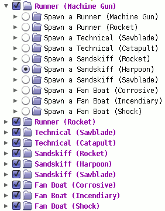

Configurable Catch-A-Ride
=========================

**NOTE:** This mod is considered deprecated.  [Our Lord and Savior Gabe Newell](https://github.com/BLCM/BLCMods/tree/master/Borderlands%202%20mods/OurLordAndSaviorGabeNewell)
has created a better version of this which lets you spawn any vehicle
from any Fast Travel station, which makes this one fairly obsolete.
[Get Our Lord and Savior Gabe Newell's "More Vehicles" mod here.](https://github.com/BLCM/BLCMods/blob/master/Borderlands%202%20mods/OurLordAndSaviorGabeNewell/MoreVehicles.blcm)

This mod is a souped-up version of FromDarkHell's "CarReplacements" mod,
which changed some of the Catch-A-Ride locations so that you can spawn
various types of vehicles throughout all the game's content.  That version
just had a few hardcoded replacements, though.  This one lets you fully
customize every single Catch-A-Ride slot in the game!

Usage
=====

This mod must be imported into BLCMM, via `File -> Import single mod`.
Choose the file `Configurable Catch-A-Ride.blcm` and have at it!

Each of the categories defaults to the stock values, so by default this
mod won't actually change anything.  You'll have to choose what you want
to spawn where.

Mod Construction / Implementation Details
=========================================

*(This section is only relevant for someone looking to edit the mod in the
same way I do, or just someone curious about my mod construction techniques.
If you're just looking to run the mod, see the "Usage" section above.  The
mod can, of course, be edited directly in FilterTool/BLCMM as well, once it's
been imported.)*

This mod is actually generated using a simple little Python script named
`generate-mod.py`.  The script makes use of `modprocessor.py` from the parent
directory.  You'd need to copy (or symlink, if you're on Mac or Linux)
`modprocessor.py` into this directory in order to run the script.

License
=======

The `generate-mod.py` script itself is licensed under the
[3-clause BSD license](https://opensource.org/licenses/BSD-3-Clause).

This mod itself is ambivalently licensed - see FromDarkHell for redistribution
and modification terms.

Credits
=======

FromDarkHell's "More Vehicles" mod was the genesis for this, and provided
the actual methods to make this work.  I just slapped together some Python to
make a more thorough version easy to generate.

Changelog
=========

**v1.0.0**, July 11, 2018:
 * Initial public release
