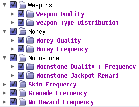

TPS Configurable Slot Machines
==============================

This mod allows you to configure just about every facet of the base game's
slot machines, of the sort found in Concordia.  The default configuration
leaves the slot machines exactly how they are in the base game -- you **must**
configure the options you want.

Keep in mind that whenever you change the frequency of one particular kind of
result, that will also alter the probabilities of everything else.  Choosing
options in the "quality" sections should keep the drop rates as they were.

Also note that if you're in developer mode in BLCMM v1.1.6, most of this mod
will complain that things will be overwritten by the game -- that's actually an
error on BLCMM's part, and should hopefully be fixed by v1.1.7.

Usage
=====

This mod must be imported into BLCMM, via `File -> Import single mod`.
Choose the file `TPS Configurable Slot Machines.blcm` and have at it!

Configuration
=============

Each of the categories defaults to the stock values, so by default this
mod won't actually change anything.  You'll have to choose what you want
to do.

* **Weapons**

  * **Weapon Quality** - This determines how good the weapons are.  Click
    through to get the exact percentage breakdown.

  * **Weapon Type Distribution** - By default, Pistols are the most likely
    type of weapon drop, and launchers are by far the least likely.  You
    can choose "Totally Even Distribution" to give an equal chance to spawn
    the various weapon types.

* **Money**

  * **Money Quality** - This determines the distribution of the 1x, 2x, or 3x
    bundles of money, when the game makes a "money" roll.  Click through to get
    the exact percentage breakdown.

  * **Money Frequency** - This will allow you to halve, double, or turn off
    money results entirely.

* **Moonstone**

  * **Moonstone Quality + Frequency** - Unfortunately, we can't split this up like
    we do with money or weapons.  This section will let you choose how good the
    Moonstone drops are (4x, 8x, or Jackpot), along with the option to double the
    Moonstone frequency in general.

  * **Moonstone Jackpot Reward** - The Moonstone jackpot result is *probably*
    intended to give you 12 Moonstone, in the same way that the slot machine in
    BL2 would give you 12 Eridium.  In the vanilla game, though, instead of dropping
    individual Moonstone shards, it drops individual moonstone clusters, resulting
    in a total jackpot of 45 Moonstone.  If you feel like nerfing that down to the
    probably-intended 12-Moonstone-Reward, you can do so here.

* **Skin Frequency** - This will allow you to halve, double, or turn off skin
  results entirely.

* **Grenade Frequency** - This will allow you to halve, double, or turn off grenade
  results entirely.

* **No Reward Frequency** - This will allow you to halve, double, or turn off the
  no-reward result entirely.

Other Recommended Mods
======================

My own "TPS Expanded Legendary Pools" mod can be configured to allow all
uniques to be in the legendary pools, which might be something you're interested
in if you've bumped up gear quality in here.  That mod is included in my own Better
Loot and Cold Dead Hands mods, as well.

Mod Construction / Implementation Details
=========================================

*(This section is only relevant for someone looking to edit the mod in the
same way I do, or just someone curious about my mod construction techniques.
If you're just looking to run the mod, see the "Usage" section above.  The
mod can, of course, be edited directly in BLCMM as well, once it's
been imported.)*

This mod is generated using a Python script named `generate-mod.py`.  The
script makes use of `modprocessor.py` from the parent directory.  You'll
need to copy (or symlink, if you're on Mac or Linux) `modprocessor.py` into
this directory in order to run the script.

License
=======

The `generate-mod.py` script itself is licensed under the
[3-clause BSD license](https://opensource.org/licenses/BSD-3-Clause).

This mod itself is licensed under
[Public Domain / CC0 1.0 Universal](https://creativecommons.org/publicdomain/zero/1.0/).

Changelog
=========

**v1.0.0**, August 6, 2018:
 * Initial public release
